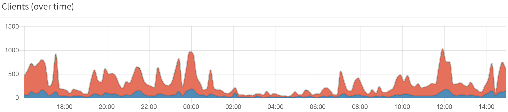

DNS noise generator that looks at your network activity and blends in. Requires [pi-hole](https://pi-hole.net) to run.

The blue graph line marks queries generated by dnoise, blending in with peaks and valleys of organic traffic.

## Recommended setup
- Use [Unbound](https://docs.pi-hole.net/guides/dns/unbound/) or [Knot-resolver](https://knot-resolver.readthedocs.io/en/stable/quickstart-install.html)
- Pair this with [dnscrypt-proxy](https://github.com/jedisct1/dnscrypt-proxy) or some other DNSCrypt/DoH client to make sure your ISP can't snoop on your queries.

## Installation Guide
A installation Guide can be found here: [Installation-Guide](../../wiki/Installation-Guide)

## ⛔ Disclaimer ⛔
These pages and the entire project is in no way affiliated with Pi-hole, which you can find on https://pi-hole.net/.
